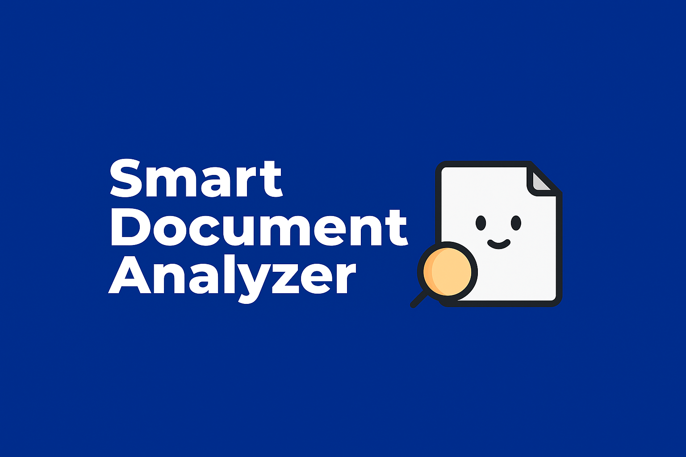

<p align="center">
  
</p>
<p align="center">
  <b>Multi-language (EN/PT) intelligent document analysis & knowledge tooling platform.</b><br/>
  Upload & batch‑analyze documents, reuse prior results instantly, organize in collections, generate quizzes, and explore—all with a performant Go + Next.js + Python stack.
</p>

<p align="center">
  <a href="https://github.com/samusafe/smart-doc-analyzer/stargazers"></a>
  <a href="https://github.com/samusafe/smart-doc-analyzer/issues"></a>
  <a href="LICENSE"></a>
  
  
  
  
</p>

<p align="center">
  <a href="#-features">Features</a> ·
  <a href="#-environment-setup">Setup</a> ·
  <a href="#running-the-project">Running</a> ·
  <a href="#-api-documentation-swagger">API Docs</a> ·
  <a href="#-testing">Testing</a> ·
  <a href="#-caching--performance">Performance</a> ·
  <a href="#-internationalization">i18n</a> ·
  <a href="#-contributing">Contributing</a> ·
  <a href="#-license">License</a>
</p>

---

## ✨ Features

| Category              | Highlights                                                                                                                       |
| --------------------- | -------------------------------------------------------------------------------------------------------------------------------- |
| Analysis              | Multi-file batch (<=10), content-hash reuse (zero reprocessing when unchanged), sentiment + keywords, quiz generation            |
| Collections           | CRUD, inline expandable folder view, lazy document listing, conflict detection (duplicate assignment)                            |
| UX & UI               | Drag & drop + whole-area click, skeleton loaders, high-contrast theme, badges (Reused / Batch / Sentiment), confirmation dialogs |
| Internationalization  | English & Portuguese, persistent user choice (localStorage), runtime detection & normalization, backend message alignment        |
| Performance           | In-memory + sessionStorage hybrid caching, soft TTL background revalidation (focus + interval), promise de-duplication           |
| Security & Robustness | Rate limiting, file type restrictions, Clerk auth integration, graceful duplicate & error messaging                              |

---

## Environment Setup

To run this project, you need to set up the environment variables.

1.  **Create a `.env` file:**
    Copy the contents of `.env.example` to a new file named `.env` in the project root.

    ```shell
    cp .env.example .env
    ```

2.  **Fill in the Environment Variables:**
    Open the `.env` file and fill in the required values. The most important variables to configure are:

    | Variable                            | Description                                                                 | Example                   |
    | ----------------------------------- | --------------------------------------------------------------------------- | ------------------------- |
    | `COMPOSE_PROFILES`                  | **Most important.** Defines the environment: `development` or `production`. | `development`             |
    | `POSTGRES_USER`                     | The database user.                                                          | `postgres`                |
    | `POSTGRES_PASSWORD`                 | The database password.                                                      | `postgres`                |
    | `POSTGRES_DB_DEV`                   | The database name for the development environment.                          | `docanalyzer_dev`         |
    | `POSTGRES_DB_PROD`                  | The database name for the production environment.                           | `docanalyzer_prod`        |
    | `CLERK_SECRET_KEY`                  | The Clerk secret key for authentication.                                    | `sk_test_...`             |
    | `NEXT_PUBLIC_CLERK_PUBLISHABLE_KEY` | The Clerk publishable key for the frontend.                                 | `pk_test_...`             |
    | `SUMMARIZER_MODEL_NAME`             | The Hugging Face model for summarization.                                   | `facebook/bart-large-cnn` |
    | `KEYBERT_MODEL_NAME`                | The sentence-transformers model for keyword extraction.                     | `all-MiniLM-L6-v2`        |
    | `QG_MODEL_NAME`                     | The Hugging Face model for quiz generation.                                 | `valhalla/t5-base-qg-hl`  |
    | `FRONTEND_PORT`                     | The external port for the frontend service.                                 | `3000`                    |
    | `BACKEND_PORT`                      | The external port for the backend service.                                  | `8080`                    |
    | `PYTHON_PORT`                       | The external port for the python service.                                   | `5000`                    |
    | `LOG_LEVEL`                         | Sets the backend log level. Can be `debug`, `info`, `warn`, or `error`.     | `info`                    |

## Running the Project

The execution is controlled by the `COMPOSE_PROFILES` variable in your `.env` file.

### For the Development Environment

This mode enables **hot-reloading** for all services, allowing you to see code changes in real-time.

1.  **Set the profile in your `.env` file:**

    ```properties
    COMPOSE_PROFILES=development
    ```

2.  **Build and start the containers:**
    ```shell
    docker compose up -d --build
    ```
    The services will be available on the ports defined in the `.env` file (e.g., `http://localhost:3000` for the frontend).

### For the Production Environment

This mode runs the optimized and secure versions of the services.

1.  **Set the profile in your `.env` file:**

    ```properties
    COMPOSE_PROFILES=production
    ```

2.  **Build and start the containers:**
    ```shell
    docker compose up -d --build
    ```

### Stopping the Application

To stop all running containers, execute:

```shell
docker compose down
```

---

## 🔐 Important Headers

| Header        | Direction | Purpose                                |
| ------------- | --------- | -------------------------------------- |
| X-Request-ID  | in/out    | Correlation ID for tracing requests    |
| Authorization | inbound   | Bearer token (Clerk)                   |
| Content-Type  | inbound   | application/json / multipart/form-data |

Clients may send X-Request-ID; if absent the backend generates one and echoes it.

## 🩺 Health & Readiness

Endpoint: GET /health

Example response:

```json
{
  "status": "ok",
  "version": "dev",
  "uptime": 12.345,
  "ready": true
}
```

Used by container HEALTHCHECK in Docker.

## 📖 API Documentation (Swagger)

The backend provides interactive API documentation using Swagger/OpenAPI.
Once the application is running, you can access it at:

[http://localhost:8080/docs](http://localhost:8080/docs)

This interface allows you to explore all available endpoints, view their parameters, and test them directly from your browser.

## 🪵 Logging

Zerolog structured logs (JSON) include fields: method, path, status, latency, cid. Set LOG_LEVEL to adjust verbosity. Recovery middleware captures panics (logs stack with cid) and returns a structured error envelope. Graceful shutdown handles SIGINT/SIGTERM with 10s timeout.

---

## 📦 Response Envelope

All successful responses are wrapped:

```
{
  "data": { ...payload },
  "correlationId": "<uuid>"
}
```

Errors use:

```
{
  "message": "Localized summary",
  "detail": { ...optional },
  "correlationId": "<uuid>"
}
```

Examples:

Analyze success:

```
{
  "data": {
    "results": [
      {"fileName": "a.txt", "reused": true, "data": {"summary": "..."}},
      {"fileName": "b.txt", "data": {"summary": "..."}}
    ]
  },
  "correlationId": "1234-..."
}
```

Analyze partial failure (one file failed):

```
{
  "data": {
    "results": [ {"fileName": "a.txt", "error": "Unsupported file type"} ],
    "error": "Some files failed"
  },
  "correlationId": "1234-..."
}
```

Collections list:

```
{"data": {"collections": [...]}, "correlationId": "...}
```

Error example:

```
{"message": "Unauthorized", "correlationId": "...}
```

Clients: always read correlationId for trace; unwrap data for payload.

---

## ⚡ Caching & Performance

| Layer                 | Mechanism                                       | Details                                               |
| --------------------- | ----------------------------------------------- | ----------------------------------------------------- |
| In-Memory             | Module-level singleton                          | Instant reuse inside a tab                            |
| SessionStorage        | Serialized snapshot                             | Hydrates after reload (same session)                  |
| Soft TTL              | 10s                                             | UI served instantly; background refresh if stale-soft |
| Hard TTL              | 30s                                             | Forces fresh fetch after expiry if accessed           |
| Revalidation Triggers | Window focus, visibility change, interval (60s) | Minimizes stale data silently                         |

---

## 🌍 Internationalization

- Locales: `en`, `pt`
- Persistent user selection (`localStorage: app.lang.v1`)
- Normalization (`pt-PT` → `pt`)
- Graceful fallback to English keys

---

## 🔐 Security Notes

| Concern        | Approach                                                    |
| -------------- | ----------------------------------------------------------- |
| Auth           | Clerk (frontend + backend validation)                       |
| Rate Limiting  | Simple token/IP burst control (config constants)            |
| File Safety    | Max 10 files, whitelist extensions (.txt, .md, .pdf, .docx) |
| Upload Limits  | Global body guard + cumulative 5MB limit per analyze call   |
| Error Handling | Localized backend messages & structured JSON                |

---

## 🧪 Testing

Lightweight unit tests illustrate core paths of the analyzer service (reuse, new document, python error, unsupported file). Service dependencies (repository, python client, file opener) are injected to enable deterministic mocking.
Run:

```
cd backend && go test ./...
```

## 🤝 Contributing

1. Fork & create branch: `feat/your-feature`
2. Frontend: `npm run lint` – Backend: `go vet ./... && go build ./...`
3. Provide screenshots / GIFs for UI changes
4. Ensure i18n keys added for both languages
5. PR description: problem → solution → screenshots → trade-offs

---

## 📄 License

Distributed under the Apache License. See [LICENSE](./LICENSE).

---

### ⭐ Support

If you find this project useful, consider giving it a star. It helps visibility & future development!

---

### 📣 Feedback & Ideas

Open an [Issue](https://github.com/samusafe/smart-doc-analyzer/issues) or start a Discussion—feature proposals & critiques welcome.
